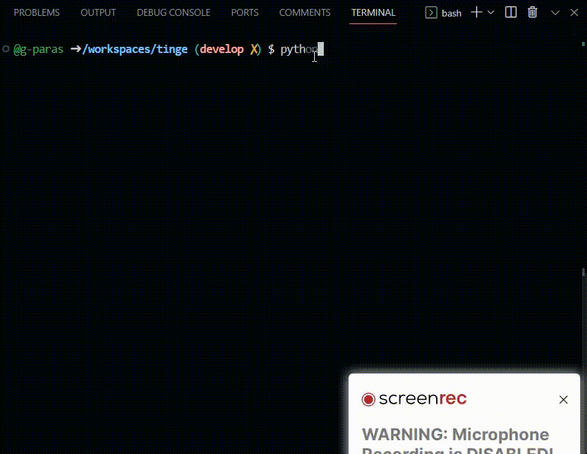

<h1 align='center'>TINGE</h1>
<h2 align='center'>Output colored terminal text from Python</h2>

<p align='center'>
    <a href="https://www.python.com">
        
    </a>
    <a href="https://github.com/psf/black">
        
    </a>
    <a href="https://github.com/g-paras/tinge/blob/master/LICENSE">
        
    </a>
    <a href="https://pypi.org/project/tinge/">
        
    </a>
    <a href="https://pepy.tech/project/tinge">
        
    </a>
</p>

## Independence Day Special



## Setup and Installation

### Using pip

```bash
pip install tinge
```

Or upgrade current version:

```bash
pip install --upgrade tinge
```

### For developers / Contributors

1. Clone this repository

```bash
git clone https://github.com/g-paras/tinge.git
cd tinge
```

2. Install the module

```python
python setup.py install
```

Installation Complete :thumbsup:

## Example

### Foreground

```python
from tinge import colored

print(colored("This is red text", color="red"))
```

Or

```python
from tinge import cprint

cprint("Hello there", color="green")
```

### Foreground and Background

```python
from tinge import colored

print(colored("Green on white", color="green", on_color="white"))
```

Or

```python
from tinge import cprint

cprint("Red on black", color="red", on_color="black")
```

### Styling

> underline & italic are not supported on windows

```python
from tinge import italic, underline, bold

print(italic("This is italic"))
print(underline("This is underlined"))
print(bold("This is bold"))
```

### Styling with Foreground and Background

```python
from tinge import colored, italic, underline, bold

print(
    underline("This is red on white",
    color="red",
    on_color="white")
)

print(
    italic("This is italic",
    color="green")
)
```

### Specific Use Cases

These method prints by default & return None

```python
from tinge import warn, error, info, success

warn("This is warning") # yellow bold text
info("This is to inform") # blue bold text
success("Success", strong=False) # green normal text
error("Error: File Missing") # red bold text
```

### Horizontal Line (width equal to terminal width)

```python
from tinge import line

line()  # a horizontal line
line(text="Hello")  # horizontal line with text in middle
line(text="Hello", color="red") # red color line with text in middle
help(line)  # for more info
```

## Available Colors and Styles

| Foreground(color) | Background(on_color) |
| ----------------- | -------------------- |
| Black             | Grey                 |
| Red               | Red                  |
| Green             | Green                |
| Yellow            | Yellow               |
| Blue              | Blue                 |
| Magenta           | Magenta              |
| Cyan              | Cyan                 |
| White             | White                |

| Style | Bold | Italic | Underline |
| ----- | ---- | ------ | --------- |

| Function    | Parameters                  | Use for                    |
| ----------- | --------------------------- | -------------------------- |
| `colored`   | _text_, _color_, _on_color_ | Colored text               |
| `italic`    | _text_, _color_, _on_color_ | Italic colored text        |
| `underline` | _text_, _color_, _on_color_ | Underlined colored text    |
| `bold`      | _text_, _color_, _on_color_ | Bold colored text          |
| `warn`      | _text_                      | Yellow Bold Warning text   |
| `error`     | _text_                      | Red Bold Error text        |
| `info`      | _text_                      | Blue Bold Information text |
| `success`   | _text_                      | Green Bold Success text    |

## _`__version__` = 0.0.5_, What's new?

- `colorama` is no longer a requirement
- `line` method for horizontal lines
- `cprint` method to directly print colored text
